<div align="center">

<!-- Animated Header -->


<h3>🏥 Your AI-Powered Personalised Healthcare Companion for Every Indian 🇮🇳</h3>

[](https://www.typescriptlang.org/)
[](https://reactjs.org/)
[](https://developer.android.com/)
[](https://nodejs.org/)
[](https://firebase.google.com/)


</div>

---

## 🎯 The Problem We're Solving

<table>
<tr>
<td width="60%">

### 🚨 Healthcare Crisis in India

India's healthcare system struggles with **fragmented primary care**, **late diagnosis**, and **poor preventive health practices**. Communities face:

- ⏱️ **Delayed Detection** - Illnesses diagnosed only when severe
- 🌐 **Language Barriers** - Limited regional language support  
- 💉 **Weak Preventive Care** - Missed vaccinations, poor adherence
- 🚑 **Emergency Delays** - Lack of ambulance coordination & instant medical info
- 🧠 **Neglected Mental Health** - Stigma prevents timely help
- 🤖 **Generic AI Advice** - No personalisation based on patient history

> **The Reality**: People seek doctors only when illness is critical. Existing solutions are fragmented. Communities need **one integrated platform**.

</td>
<td width="40%">

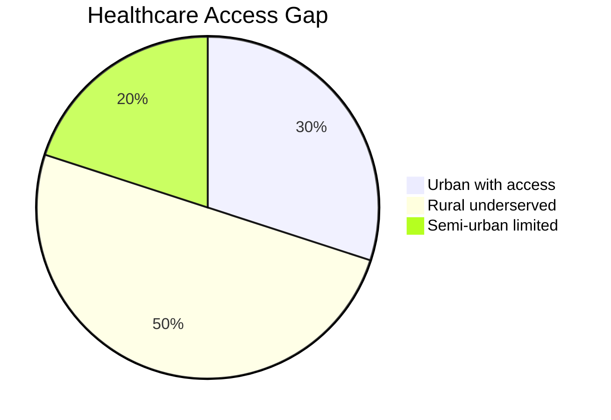

### 📉 Impact Stats

- **70%** Late diagnosis cases
- **60%** Lack preventive care
- **45%** Language barriers
- **80%** Mental health stigma

</td>
</tr>
</table>

---

## 💡 Our Solution: AarogyaSaarthi

<div align="center">

### **The All-in-One Personalised Healthcare Ecosystem**

*Tele Consultation with automated transcript + Personalised AI Companion + Exercise Coach + Wearable Hub + ML Disease Detection + Emergency SOS Android App + Doctor Android App + Vaccination Tracker + Jan Aushadhi & Govt. scheme Locator*

#### **11 Powerful Features. 1 Unified Platform. ∞ Lives Impacted.**


</div>

---

## ✨ Core Features

<table>
<tr>
<td width="33%" valign="top">

### 🤖 AI Disease Detection


- 📸 Upload skin/oral/X-ray images
- 🧠 CNN ensemble analysis
- 📊 Instant diagnostic suggestions
- 🎯 Confidence level scoring
- 📱 Mobile-first interface

**Tech Stack:**
<p>


</p>

</td>
<td width="33%" valign="top">

### 🚨 Smart Emergency System


- 🚑 One-tap SOS ambulance call
- 📍 Live GPS tracking (Leaflet + OSRM)
- 👨‍👩‍👧 Auto family notifications
- 🗺️ Nearest hospital routing
- ⏱️ ETA calculations

**Tech Stack:**
<p>


</p>

</td>
<td width="33%" valign="top">

### 👨‍⚕️ Telemedicine Console


- 🎥 Secure video calls
- 📝 **Live consultation transcript** in webapp
- 💊 **Prescription + Jan Aushadhi Locator**
- 📄 Auto-generated PDF reports
- 🔒 HIPAA-compliant storage

**Tech Stack:**
<p>


</p>

</td>
</tr>

<tr>
<td width="33%" valign="top">

### 🗣️ Personalised AI Chatbot


- 🩺 **Answers based on YOUR health resume**
- 🌐 Regional language support
- 🎤 Voice-to-text (STT)
- 📊 Text-to-speech (TTS)
- 💬 24/7 personalised availability

**Tech Stack:**
<p>


</p>

</td>
<td width="33%" valign="top">

### 💉 Vaccination Tracker


- 📅 Digital vaccine schedule
- ⏰ Push notifications
- 👪 Family member profiles
- 🏥 Health center integration
- 📊 Completion tracking

**Tech Stack:**
<p>


</p>

</td>
<td width="33%" valign="top">

### 🗺️ Doctor Discovery Heatmap


- 🔍 Nearby doctor locator
- 🏥 Specialty filtering
- ⭐ Ratings & reviews
- 🕐 Real-time availability
- 📞 Direct booking

**Tech Stack:**
<p>


</p>

</td>
</tr>

<tr>
<td width="33%" valign="top">

### 🧠 Mental Health Assessment


- 📋 PHQ-9 depression screening
- 😰 GAD-7 anxiety assessment
- 📈 Risk scoring system
- 🤝 Therapist matching
- 📊 Progress tracking

**Tech Stack:**
<p>


</p>

</td>
<td width="33%" valign="top">

### 🧘 YOLOv8 Exercise Guidance


- 📹 Real-time pose detection
- ✅ Posture correction
- 🔢 Rep counting
- 🧘 Yoga pose validation
- 📊 Workout analytics

**Tech Stack:**
<p>


</p>

</td>
<td width="33%" valign="top">

### ⌚ Wearable Integration


- 💓 Heart rate monitoring
- 🫁 SpO₂ tracking
- 👟 Step counter
- 😴 Sleep analysis
- 📊 Health dashboards

**Tech Stack:**
<p>


</p>

</td>
</tr>
</table>

---

## 📱 Android Apps — New!

<div align="center">

### **Two Purpose-Built Native Android Applications**


</div>

---

### 🆘 App 1 — AarogyaSaarthi Patient Emergency App

<div align="center">


</div>

<br/>

> **The Problem:** In an emergency, the patient is often unconscious or unable to speak. Precious minutes are lost gathering basic medical information. Our answer: a **persistent, always-on emergency identity** — right in the notification bar.

<table>
<tr>
<td width="50%" valign="top">

#### 🔔 Always-On Notification Bar

The **AarogyaSaarthi** notification lives permanently in the Android notification tray. In any emergency — no unlock, no navigation, no app search needed.

```
┌─────────────────────────────────────┐
│  🏥 AarogyaSaarthi   [Active]       │
│  Tap in emergency for instant help  │
└─────────────────────────────────────┘
```

One tap on this notification triggers a **non-display overlay popup** — it appears without launching the full app, even from the lock screen.

</td>
<td width="50%" valign="top">

#### 📋 Instant Emergency Popup

The overlay popup immediately shows first responders everything they need:

| Field | Details |
|-------|---------|
| 👤 **Patient Name** | Registered full name |
| 🩸 **Blood Group** | e.g., B+ |
| ⚠️ **Known Allergies** | Critical drug alerts |
| 🏥 **Conditions** | Chronic illnesses |
| 📞 **Emergency Contact** | Family number |
| 📲 **QR Code** | Full health resume |

</td>
</tr>
</table>

#### 📲 Health Resume QR Code

<table>
<tr>
<td width="50%" valign="top">

The QR code displayed on the popup encodes the **patient's entire medical history**:

- 📋 Past diagnoses & chronic conditions
- 💊 Current medications & dosages
- ⚠️ Allergies & contraindications
- 🩸 Blood group & organ donor status
- 🏥 Previous surgeries & hospitalizations
- 💉 Vaccination history
- 📞 Emergency contacts

> **Scan once → Know everything. No login. No internet needed.**

</td>
<td width="50%" valign="top">

```
┌──────────────────────────────────┐
│  👤 Rahul Sharma   🩸 B+         │
│  ⚠️  Penicillin Allergy          │
│                                  │
│   ┌──────────────────────┐       │
│   │  ▄▄▄ ▄  ▄ ▄▄▄        │       │
│   │  █ █ █▄▄█ █ █  QR    │       │
│   │  ▀▀▀ ▀  ▀ ▀▀▀        │       │
│   └──────────────────────┘       │
│                                  │
│  📞 Emergency Contact: Listed    │
│                                  │
│  [🚨 GENERATE SOS]               │
└──────────────────────────────────┘
```

</td>
</tr>
</table>

#### 🚨 One-Tap SOS Automation

Tapping **GENERATE SOS** on the popup triggers a fully automated emergency response — without the patient needing to do anything more:

```mermaid
flowchart LR
    A[🔔 Tap Notification] --> B[Overlay Popup Appears]
    B --> C[Patient Info + QR Displayed]
    C --> D[Tap GENERATE SOS]
    D --> E[📍 Capture Last Known GPS Location]
    E --> F[📞 Auto-call All Family Members]
    F --> G[📲 SMS with Location Link Sent]
    G --> H[🚑 Nearest Ambulance Alerted]
    H --> I[✅ Emergency Response Initiated]
```

- 📞 **Automated calls** to all registered family members
- 📍 **Live GPS location** shared via SMS link
- 🔁 **Retry logic** if family members don't pick up
- No typing. No navigation. No internet dependency for core SOS.
---

### 🩺 App 2 — AarogyaSaarthi Doctor App

<div align="center">


</div>

<br/>

> **The Problem:** Doctors in emergency wards waste critical minutes asking basic questions to unconscious patients, or waiting for families to provide medical history. Our Doctor App **eliminates this wait entirely**.

<table>
<tr>
<td width="50%" valign="top">

#### ⚡ Instant Patient Intake via QR

When a patient arrives in emergency with the AarogyaSaarthi notification active, the attending doctor simply **opens the Doctor App and scans the QR code**.

```
Doctor scans QR  →  Full medical history 
                     loads in seconds
```

**What the doctor instantly sees:**

- 🧾 Complete past medical history
- 💊 All current medications (with dosages)
- ⚠️ Allergies & drug contraindications
- 🩸 Blood group & transfusion history
- 🏥 Previous surgeries & procedures
- 🔬 Recent lab reports & vitals
- 📋 Consultation notes from past doctors

</td>
<td width="50%" valign="top">

#### 🏥 Hospital EMR Sync

The Doctor App syncs directly with the **hospital's records system**, meaning:

- New consultation is **auto-logged** under the patient's profile
- Prescriptions issued are **pushed to patient's health resume**
- Lab orders are **pre-filled** with patient details
- Next doctor seeing this patient gets **updated history** automatically

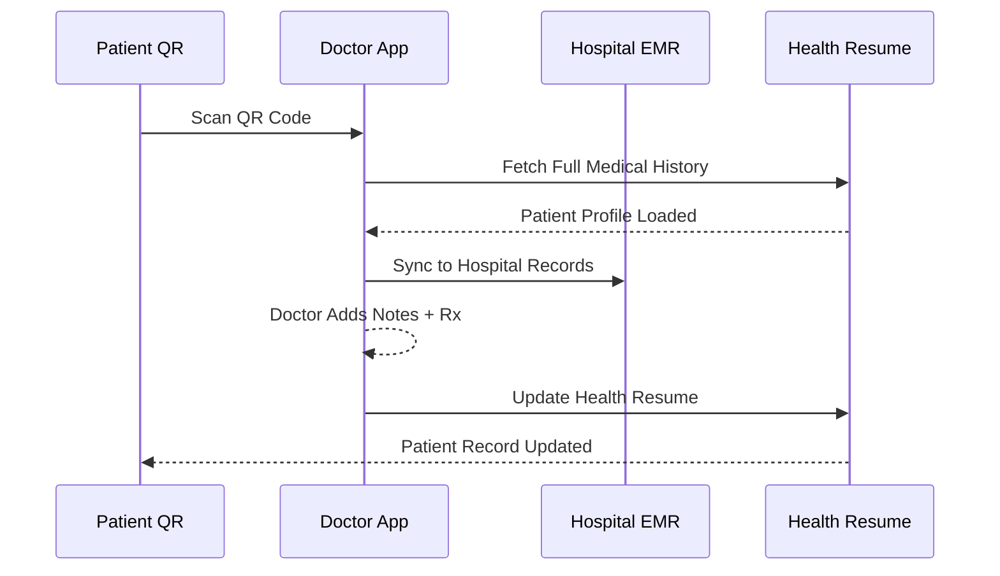

</td>
</tr>
</table>

<div align="center">
<br>
<div style="display:flex; gap:10px;">
  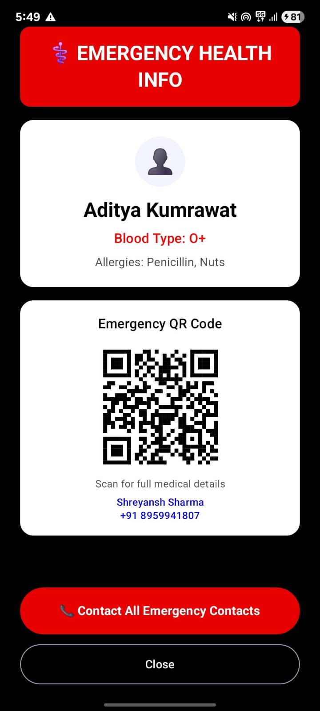
  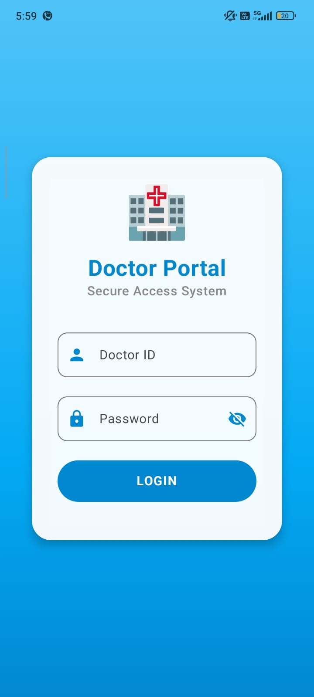
  
  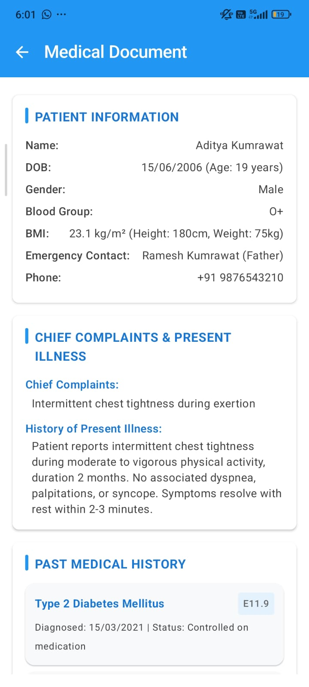

</div>

**Result: From emergency to informed treatment in under 60 seconds.**

</div>

---

## 🔄 Updated Features — What's New

---

### 📋 Telemedicine — Now with Live Transcript + Jan Aushadhi Finder

<div align="center">


</div>

<br/>

The telemedicine platform has been significantly upgraded. Patients no longer need to frantically take notes during a consultation — everything is **captured, structured, and actionable** within the webapp itself.

<table>
<tr>
<td width="50%" valign="top">

#### 📝 Live Consultation Transcript

During the video call, a **real-time transcript** appears alongside the video feed — updated word-by-word as doctor and patient speak.

After the consultation ends, the patient can **scroll down through the full transcript** to revisit everything discussed — no memory required, no notes needed.

```
┌─────────────────────────────────────┐
│  📹 Video Call — Dr. Priya Sharma   │
│  ─────────────────────────────────  │
│  LIVE TRANSCRIPT                    │
│                                     │
│  Dr: "Looking at your reports, I    │
│       think this is a viral fever." │
│                                     │
│  You: "Should I be worried?"        │
│                                     │
│  Dr: "No, rest and these medicines  │
│       for 5 days will help."        │
│  ─────────────────────────────────  │
│  ⬇ Scroll for Prescription          │
└─────────────────────────────────────┘
```

</td>
<td width="50%" valign="top">

#### 💊 Prescription + Nearest Jan Aushadhi Kendra

Scroll below the transcript and the patient sees the **structured prescription** generated from the consultation — and right below it, a **live map of the nearest Jan Aushadhi Kendras** where these medicines are available at **affordable government prices**.

```
┌─────────────────────────────────────┐
│  💊 PRESCRIPTION                    │
│  ─────────────────────────────────  │
│  • Paracetamol 500mg — 3x daily     │
│  • Cetirizine 10mg — 1x at night    │
│  • ORS Sachets — as needed          │
│  ─────────────────────────────────  │
│  🏪 NEAREST JAN AUSHADHI KENDRAS    │
│  📍 PM Bharatiya Jan Aushadhi — 0.8km│
│  📍 Generic Pharma Kendra — 1.2km   │
│  📍 Aushadhi Store, MP Nagar — 2km  │
│  ─────────────────────────────────  │
│  [🗺️ Open in Maps]  [📄 Download Rx]│
└─────────────────────────────────────┘
```

> **Impact:** Patients save up to 90% on medicines by accessing Jan Aushadhi stores instead of branded pharmacies.

</td>
</tr>
</table>

---

### 🧠 AI Chatbot — Now Truly Personalised (Not Generic!)

<div align="center">


</div>

<br/>

> **The Fundamental Problem with Every Other Chatbot:**  
> Ask ChatGPT, Gemini, or any AI assistant about a headache — it gives the exact same answer to every person on the planet: *"Take paracetamol, rest, drink water."*  
> That's not healthcare. That's a generic FAQ.

**AarogyaSaarthi is different.** Before responding to any health query, our bot **reads your entire health resume** — your conditions, medications, allergies, past diagnoses — and answers based on *you specifically*.

<table>
<tr>
<td width="50%">

#### 💬 Generic AI (Everyone Else)

```
User: "I have a headache"

ChatGPT / Generic AI:
──────────────────────────────
"Headaches can be caused by 
 dehydration, stress, or tension.

 Try:
 • Paracetamol 500mg
 • Rest in a dark room
 • Drink plenty of water"

[Same answer. For everyone. Always.]
```

</td>
<td width="50%">

#### 🩺 AarogyaSaarthi Bot (Personalised)

```
User: "I have a headache"

AarogyaSaarthi (reads health resume):
──────────────────────────────────────
📋 Analysing your health resume...
   • You have Type 2 Diabetes
   • Currently on Metformin 500mg
   • BP: 138/88 (last recorded)
   • Allergic to Aspirin

"Given your blood pressure history and 
 current medications, this headache 
 could be BP-related. Avoid Aspirin 
 and Ibuprofen due to your allergy.
 
 Paracetamol is safe for you.
 
 If headache persists >2 hours or BP 
 feels high, consult Dr. Sharma (your 
 last cardiologist) immediately."
```

</td>
</tr>
</table>

#### 🔬 How Health Resume Context Works

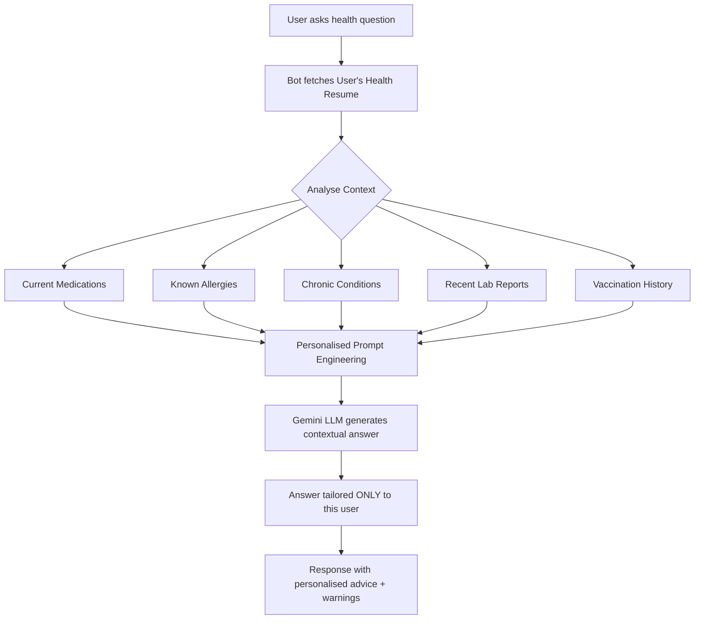

**Examples of Personalisation:**

| Condition in Health Resume | How Bot Adapts |
|---------------------------|----------------|
| 🩺 Diabetic patient | Never suggests high-sugar home remedies |
| ⚠️ Penicillin allergy | Warns when any antibiotic is discussed |
| 💊 On blood thinners | Flags interaction risks with NSAIDs |
| 🫀 Heart condition | Recommends cardiologist over self-medication |
| 🤰 Pregnancy noted | Gives pregnancy-safe alternatives only |
| 🧒 Child profile | Adjusts dosage references to child weight |

---

## 🏗️ System Architecture

<div align="center">

### **Production-Ready Full-Stack TypeScript + Android Application**


</div>

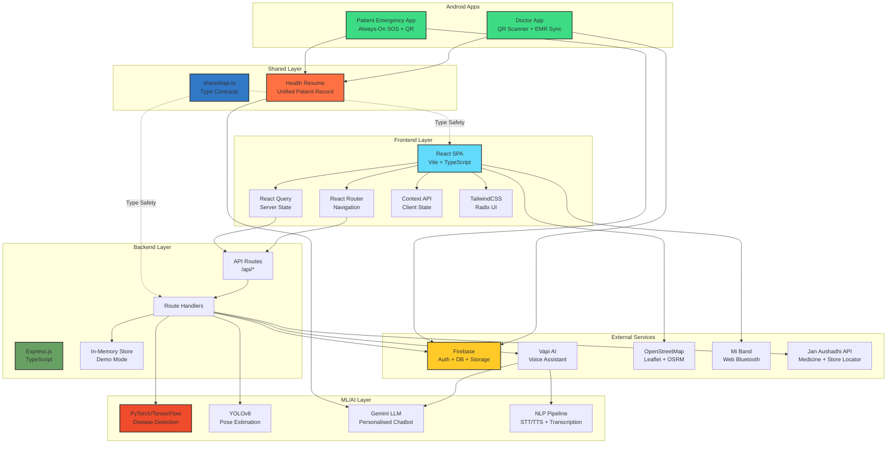
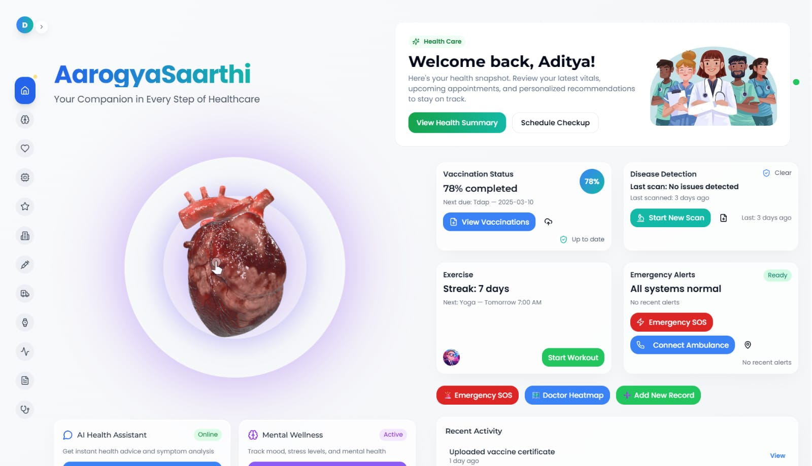
<div style="display:flex; gap:10px;">
  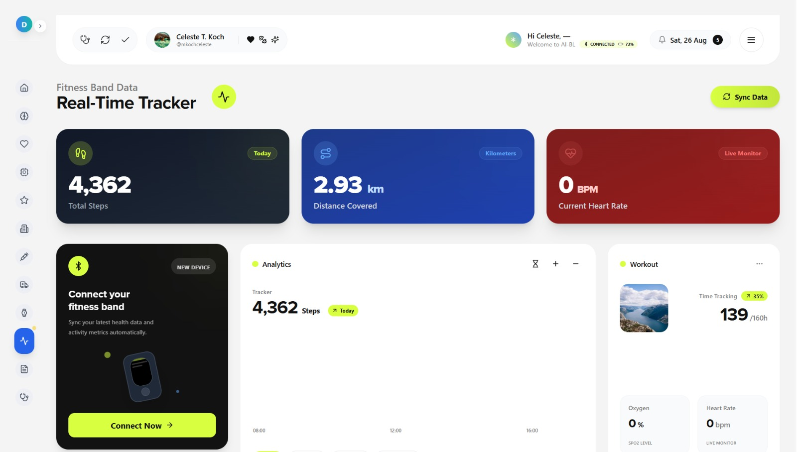
  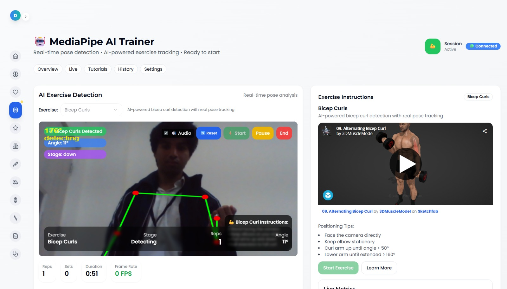
  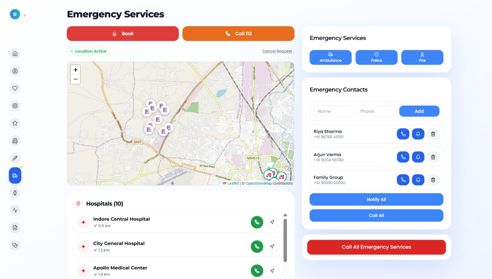
  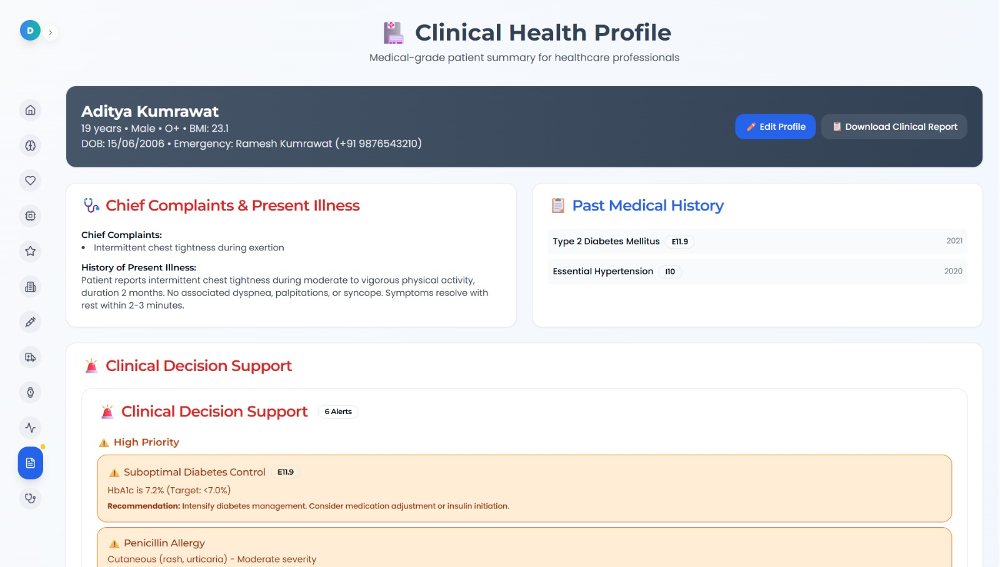
  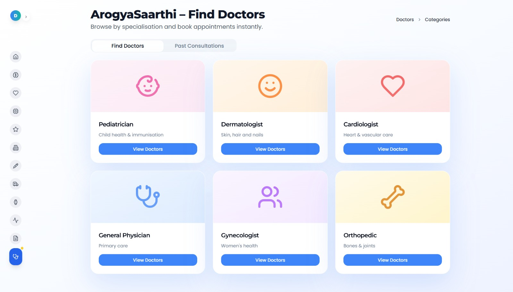
  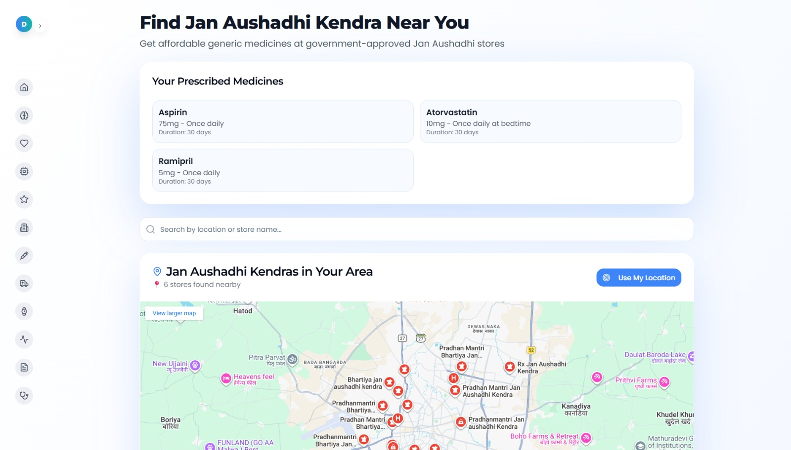
  


</div>
---

## 🛠️ Technology Stack

<div align="center">

### **Modern, Type-Safe, Production-Grade Stack**

</div>

### Frontend Technologies

<table>
<tr>
<td width="50%">

#### Core Framework
<p>


</p>

#### State Management
<p>


</p>

#### Styling & UI
<p>


</p>

</td>
<td width="50%">

#### Routing & Navigation
<p>

</p>

#### Maps & Geolocation
<p>


</p>

#### Data Visualization
<p>


</p>

</td>
</tr>
</table>

### Android Technologies

<table>
<tr>
<td width="50%">

#### Patient Emergency App
<p>


</p>
<p>


</p>

</td>
<td width="50%">

#### Doctor App
<p>


</p>
<p>


</p>

</td>
</tr>
</table>

### Backend Technologies

<table>
<tr>
<td width="50%">

#### Core Server
<p>


</p>

</td>
<td width="50%">

#### Data Storage
<p>


</p>

</td>
</tr>
</table>

### AI/ML Stack

<table>
<tr>
<td width="50%">

#### Deep Learning
<p>


</p>

</td>
<td width="50%">

#### NLP, Voice & Personalisation
<p>


</p>

</td>
</tr>
</table>

### Integration Stack

| Integration | Technology | Purpose |
|------------|------------|---------|
| 🔐 **Authentication** |  | Secure user management |
| 💾 **Database** |  | Real-time data sync |
| 📦 **Storage** |  | File uploads (images, PDFs) |
| 🗺️ **Maps** |  | Location services |
| 🚑 **Routing** |  | Ambulance route optimization |
| ⌚ **Wearables** |  | Mi Band connectivity |
| 🤖 **Voice AI** |  | Conversational interface |
| 🧠 **LLM** |  | Personalised contextual responses |
| 💊 **Medicines** |  | Affordable medicine locator |
| 📲 **Android SOS** |  | Always-on emergency notification |
| 🔍 **QR Scan** |  | Doctor patient QR intake |


---

## 🌟 Unique Selling Points

<div align="center">

### **What Makes AarogyaSaarthi Different?**


</div>

<table>
<tr>
<td width="50%">

### 🎯 **All-in-One Platform**

The **ONLY** platform that combines:
- ✅ Practo's consultation features
- ✅ Mental health companion
- ✅ Personal exercise coach
- ✅ Wearable device hub
- ✅ ML disease detection
- ✅ Real-time ambulance tracking
- ✅ Vaccination management
- ✅ **Emergency SOS Android App** 🆕
- ✅ **Doctor QR Scanner App** 🆕
- ✅ **Live consultation transcript** 🆕
- ✅ **Jan Aushadhi medicine locator** 🆕

**11 features. 1 unified platform.**

</td>
<td width="50%">

### 🆘 **Always-On Emergency QR Identity**

**World's first always-on health identity:**

- 🔔 Persistent notification — no unlock needed
- 🆔 Instant patient info popup for responders
- 📲 QR code holds complete medical history
- 🤖 Auto SOS calls + GPS to all family members
- 🩺 Doctor scans QR → full history in seconds
- 🏥 Hospital EMR auto-updated post-consultation

*Because in emergencies, seconds are lives.*

</td>
</tr>
<tr>
<td width="50%">

### 🧠 **Truly Personalised AI (Not Generic!)**

**Every other chatbot gives generic answers.  
We give YOUR answers.**

- 📋 Reads your full health resume before responding
- ⚠️ Warns about your specific drug allergies
- 💊 Avoids medications that conflict with your prescriptions
- 🩺 References your actual doctors & conditions
- 🤰 Adapts for pregnancy, age, chronic illnesses

*The difference between a search engine and a doctor.*

</td>
<td width="50%">

### 💊 **Post-Consultation Jan Aushadhi Finder**

**Unlike Practo — we don't just prescribe, we help you afford it:**

- 📝 Full consultation transcript in webapp
- 💊 Structured prescription auto-extracted
- 🗺️ Nearest Jan Aushadhi Kendra on live map
- 💸 Up to 90% savings vs branded pharmacies
- 📍 Distance, hours, availability shown

*Healthcare doesn't end at the prescription.*

</td>
</tr>
</table>

---

## 🌍 Social Impact & Vision

<div align="center">

### **Mission: Healthcare Equity for 1.4 Billion Indians**


</div>

### Benefits to Society

| Benefit | Impact | Measurement |
|---------|--------|-------------|
| 🚨 **Emergency Response** | QR health resume eliminates intake delays | From 15 min → under 60 sec patient intake |
| 👨‍👩‍👧 **Equitable Access** | Rural, semi-urban, low-income communities | 70% rural penetration target |
| 💸 **Medicine Affordability** | Jan Aushadhi locator post-consultation | Up to 90% cost savings |
| 🧠 **Personalised Care** | Health resume-driven AI, not generic advice | Patient-specific, clinically contextual |
| 📉 **Hospital Burden** | Early triage prevents unnecessary admissions | 40% reduction in non-critical cases |
| 🗣️ **Inclusivity** | Multilingual + voice interface | 10+ Indian languages supported |
| 📊 **Policy Support** | Community health dashboards | Data-driven intervention planning |

---

## 👥 Team Quad Binary

<div align="center">

### **Leveraging AI for Sustainable Living Solutions**


*Acropolis Institute of Technology and Research*

</div>

<br/>

<table>
<tr>
<td align="center" width="25%">
<br />
<sub><b>🚀 Aditya Tiwari</b></sub><br />
<sub>🎓 AITR</sub><br />
<br />
<kbd>Frontend Engineer</kbd><br />
<kbd>OpenCV Specialist</kbd><br />
<kbd>Android Developer</kbd><br />
<br />
<p>


</p>
<a href="https://github.com/adityatiwari12">
  
</a>
</td>

<td align="center" width="25%">
<br />
<sub><b>🤖 Aditya Kumrawat</b></sub><br />
<sub>🎓 AITR</sub><br />
<br />
<kbd>ML Engineer</kbd><br />
<kbd>Full Stack Developer</kbd><br />
<kbd>AI & RAG Specialist</kbd><br />
<br />
<p>


</p>
<a href="https://github.com/Aditya-Kumrawat">
  
</a>
</td>

<td align="center" width="25%">
<br />
<sub><b>⚙️ Shreyansh Sharma</b></sub><br />
<sub>🎓 AITR</sub><br />
<br />
<kbd>Backend Engineer</kbd><br />
<kbd>AI Developer</kbd><br />
<kbd>API Architect</kbd><br />
<br />
<p>


</p>
<a href="https://github.com/shreyanshsharma-1210">
  
</a>
</td>

<td align="center" width="25%">
<br />
<sub><b>🎨 Shubh Paliwal</b></sub><br />
<sub>🎓 AITR</sub><br />
<br />
<kbd>UI/UX Engineer</kbd><br />
<kbd>Database Engineer</kbd><br />
<kbd>Design Systems</kbd><br />
<br />
<p>


</p>
<a href="https://github.com/ShubhPaliwal11">
  
</a>
</td>
</tr>
</table>

---


## 🔒 Security & Privacy

<div align="center">

### **Your Health Data is Sacred**

<p>


</p>

</div>

- 🔐 **End-to-End Encryption** — All sensitive data encrypted in transit and at rest
- 🛡️ **HIPAA Compliance** — Follows healthcare data protection standards
- 🔒 **QR Security** — Health resume QR codes are encrypted and time-limited
- 🚫 **No Data Selling** — We never sell or share your health data
- 📝 **Audit Logs** — Complete audit trail for all data access including doctor QR scans
- 👨‍⚕️ **Doctor Verification** — All doctors verified with valid medical licenses before app access

---

## ❓ FAQ

<details>
<summary><b>Q: Does the Emergency SOS work without internet?</b></summary>
<br/>
<p>The QR code generation and the notification bar popup work offline. The SOS calls and GPS location sharing use standard cellular networks (not data) for calls, and mobile data/WiFi for location SMS. Core identity display is offline-capable.</p>
</details>

<details>
<summary><b>Q: Can any doctor scan the QR, or only registered doctors?</b></summary>
<br/>
<p>For security, doctors must have a verified AarogyaSaarthi Doctor App account to access the full health resume. Emergency first responders see basic info (name, blood group, allergies) without login — full history requires doctor verification.</p>
</details>

<details>
<summary><b>Q: How is the AI chatbot personalised to me?</b></summary>
<br/>
<p>The chatbot retrieves your health resume before every response. It uses Retrieval-Augmented Generation (RAG) to inject your medical context into the prompt sent to Gemini LLM, ensuring every answer is tailored to your conditions, allergies, and medications — not generic population-level advice.</p>
</details>

<details>
<summary><b>Q: How does the Jan Aushadhi locator work?</b></summary>
<br/>
<p>After a telemedicine consultation, the system extracts medicines from the generated prescription and queries the Jan Aushadhi API with the patient's GPS location to surface the nearest stores with real-time availability, distance, and hours.</p>
</details>

<details>
<summary><b>Q: Is the consultation transcript stored securely?</b></summary>
<br/>
<p>Yes. Transcripts are encrypted and stored in Firebase with HIPAA-compliant access controls. Only the patient and their treating doctor can access the consultation transcript.</p>
</details>

<details>
<summary><b>Q: Which languages are supported?</b></summary>
<br/>
<p>We support 10+ Indian languages including Hindi, Tamil, Telugu, Bengali, Marathi, and more. Voice support is available for major languages, and the personalised AI chatbot is multilingual.</p>
</details>

---

<div align="center">


### Made with ❤️ by Team Quad Binary

<p>


</p>

### ⭐ Don't forget to star this repo if you found it helpful!

---

**AarogyaSaarthi** - *Your AI-Powered Personalised Healthcare Companion* 🏥

Copyright © 2026 Team Quad Binary. All rights reserved.

</div>
